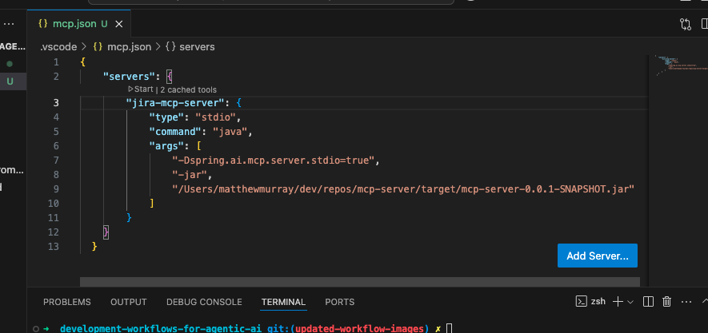
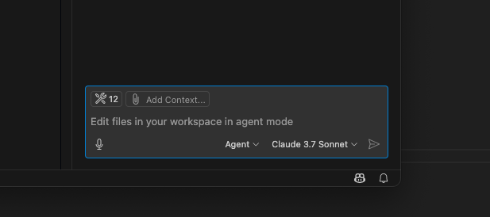
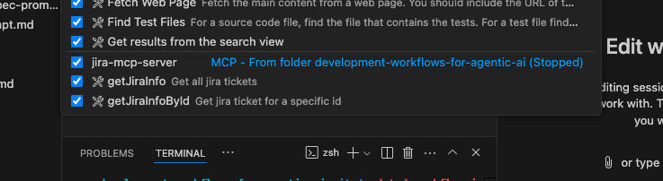
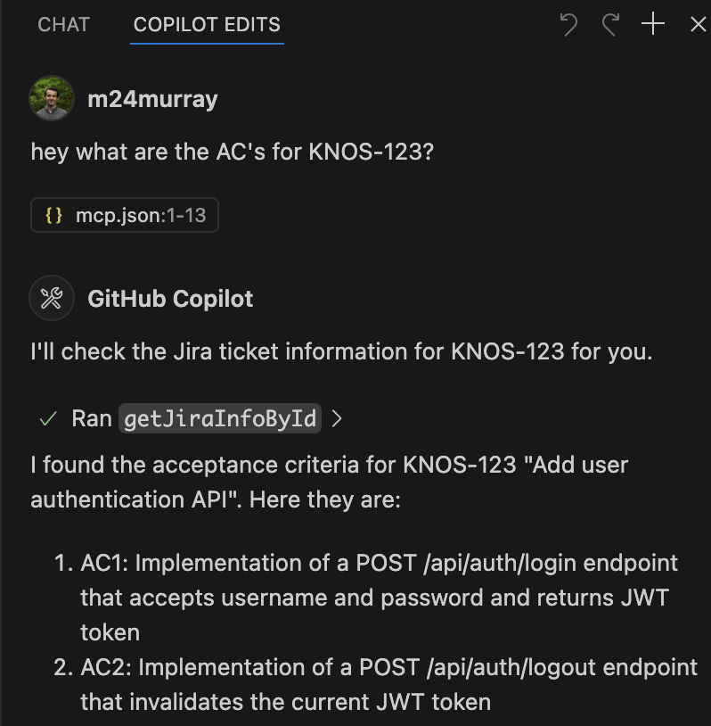

# mcp-example

An example stack for integrating Model Context Protocol (MCP) into a GenAI tool.

This repository contains two projects:

1. **mcp-server**  
    The MCP server that exposes data/endpoints for use in the context of a GenAI tool such as GitHub Copilot.

2. **mock-jira-server**  
    A mock implementation of a Jira API or any other data source for demonstration purposes.

## Getting Started

### Step 1: Run the Mock Jira Server Application

This step is for demonstration purposes and represents a real-world data source like an actual Jira HTTP endpoint.

Run the application:

```bash
cd mock-jira-server
mvn clean install spring-boot:run
```

Verify the application is running by visiting:  
[http://localhost:8080/jira/KNOS-123](http://localhost:8080/jira/KNOS-123)

---

### Step 2: Create an Executable MCP Server

This step creates an executable MCP server in the form of a Java JAR file.

It exposes the Jira methods which have been defined in Step 1.

```bash
cd mcp-server
mvn clean install
```

Note the full path of the generated JAR file, for example:


> /Users/kainos/dev/mcp-server/target/mcp-server-0.0.1-SNAPSHOT.jar

---

### Step 3: Connect GitHub Copilot to Your MCP Server

1. Create a file named `mcp.json` in the project where GitHub Copilot is running.

2. Add the following configuration, updating the `args` section with the path to your JAR file from Step 2:

    ```json
    {
         "servers": {
              "jira-mcp-server": {
                    "type": "stdio",
                    "command": "java",
                    "args": [
                         "-Dspring.ai.mcp.server.stdio=true",
                         "-jar",
                         "/Users/kainos/dev/mcp-server/target/mcp-server-0.0.1-SNAPSHOT.jar"
                    ]
              }
         }
    }
    ```

    > Note: This example uses a local JAR file, but you can also use other types such as HTTP.

3. Save the file and use the inline `Start` command to run the MCP server. This essentially runs the JAR file.  
    

4. In your chat window, click the tools icon in the top-right corner.  
    

5. Ensure the tools/methods set up by your MCP server are visible and checked.  
    

---

### Example Query

Once the MCP server is running, you can make requests to query Jira information. For example:

> "Hey, what are the ACs for KNOS-123?"


